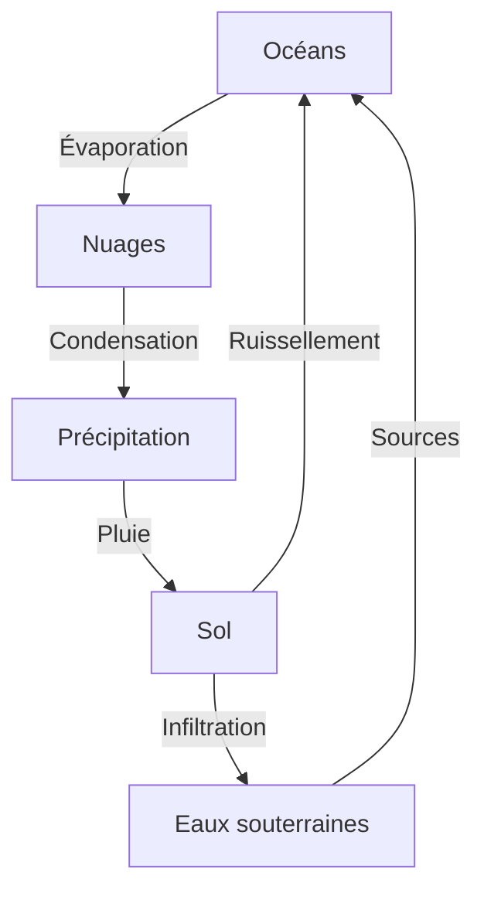

```mermaid
graph TD
    A[Océans] -->|Évaporation| B[Nuages]
    B -->|Condensation| C[Précipitation]
    C -->|Pluie| D[Sol]
    D -->|Ruissellement| A
    D -->|Infiltration| E[Eaux souterraines]
    E -->|Sources| A
```
